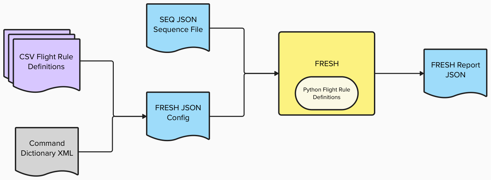

# Flight Rule Evaluation Sequencing Helper (FRESH) User's Guide

## Table of Contents
1. [Overview](#overview)
    1. [General Scope](#general-scope)
    2. [Data Flow](#data-flow)
2. [Configuration](#configuration)
    1. [Command Line Arguments](#command-line-arguments)
    2. [Flight Rule Configuration File](#configuration-file)
    3. [CSV Flight Rule Definition Files](#csv-flight-rule-definition-files)
        1. [Command Existence Rule CSV](#command-existence-rule-csv)
        2. [Command Argument Rule CSV](#command-argument-rule-csv)
        3. [Command Timing Rule CSV](#command-timing-rule-csv)
    4. [Python "Bespoke" Flight Rules](#python-bespoke-flight-rules)
3. [Usage](#usage)
    1. [Running FRESH](#running-fresh)
    2. [FRESH Report Structure](#fresh-report-structure)
        1. [Metadata](#metadata)
        2. [Summary](#summary)
        3. [Flight Rule Checks (fr_checks)](#flight-rule-checks-fr_checks)
            1. [Flight Rule Overview](#flight-rule-overview)
            2. [Flight Rule Results](#flight-rule-results)
    3. [Assumptions](#assumptions)
4. [Known Issues](#known-issues)


## Overview
FRESH is a limited flight rule evaluation tool for use on SEQ JSON files. It runs on a single SEQ JSON file, evaluating a number of flight rules as defined by the configuration of FRESH at runtime, and outputs a JSON file called a FRESH report. The configuration points to CSV files which define the flight rules to be checked. The FRESH report provides the status of every rule in the configuration and in the FRESH Python flight rules code, whether or not it was checked, and detailed results of each individual check.

### General Scope
The scope of FRESH can be summarized in the following driving design concepts:
1. Check flight rules against sequence files directly without requiring modeling, so rule can be checked early in the sequence authoring process.
2. Reduce false negatives as much as possible, even if the number of false positives increases.
3. Allow for easy and fast authoring of simple rules, rather than covering every possible rule use case.

Concept 1 drives the use of SEQ JSON files as inputs. FRESH does not replace the use of tools like SEQGEN, which can provide more accurate results by modeling the execution of a sequence or multiple sequences. Instead, FRESH performs static checks on a single sequence file, performing only a small amount of simple timing resultion and execution path evaluation. If the result of a rule check is unclear, the result is flagged for human review rather than assuming to have passed or failed. While the results may not be as nuanced as a tool with full modeling capabilities, FRESH only requires a single sequence file to run and thus can be used by a wider variety of users earlier in the sequence generation process.

Concept 2 drives the strategy for marking rules as flagged or violated. When there is uncertainty about the evaulation of a rule, or if there is information needed to fully evaluate a rule that FRESH does not have access to, FRESH will not mark a rule as PASSED. The exact implementation of this philosophy can vary from one flight rule to another.

Concept 3 drives the implementation of the three CSV rule definition file types, which are defined in more detail in following sections. The CSVs combined with the configuration allows users to add more rules (or remove rules) without requiring the software to be redelivered. There are limitations to the type of rules that can be defined in these CSV files, so FRESH also provides a Python class interface for defining custom rule checks. The custom rule checks cannot be swapped in or out at runtime.


### Data Flow



## Configuration

### Command Line Arguments
|Argument|Tags|Required|Description|
|--|--|--|--|
|Input File|`-i`, `--input-file`|Yes|The SEQ JSON file to check.|
|Output File|`-o`, `--output-file`|No|Custom output file path and name. By default, the fresh report will be placed in the current directory with the name `[sequence ID]_[datetime].fresh_report.json`.|
|Config File|`-c`, `--config-file`|No|Path to a custom configuration file. If none is provided, the default configuration for the current version of FRESH will be used.|
|Verbose Run|`-v`, `--verbose`|No|Whether to print information about flight rule violations to the console while running. By default, only a summary will be printed at the end of a console run. In verbose mode, individual violations will be printed to the console while FRESH is running, in addition to printing the summary when the run is completed.|
|Quiet Report|`-q`, `--quiet`|No|Whether to suppress individual PASSED results in the FRESH report. By default, PASSED results will be included in the output. In quiet report mode, only the rule check summary for PASSED flight rules will be included with empty individual results, even if individual checks were performed.|

### Configuration File
FRESH uses a configuration file to locatate flight rule CSV files and other information needed for the configuration of FRESH. The configuration is a JSON file with four sections. All sections in the FRESH configuration file are required. The sections are "command_dictionary_path", "command_existence_rule_files", "command_argument_rule_files", and "command_timing_rule_files", which can be included in any order. Each of the rule_files sections should contain a list of file paths pointing to CSV files of that flight rule type, and the "command_dictionary_path" should point to the location of the command dictionary file. The specifications for the CSV files are described in the next section. The following is an example of a complete FRESH configuration file:

```
{
    "command_existence_rule_files": [
        "../flightrules/command_existence_rules/hw_commands.csv",
        "../flightrules/command_existence_rules/permanent.csv",
        "../flightrules/command_existence_rules/remove-after-1-AU.csv",
        "../flightrules/command_existence_rules/remove-after-3-AU.csv",
        "../flightrules/command_existence_rules/remove-after-JOI.csv",
        "../flightrules/command_existence_rules/remove-after-reason-deployed.csv",
        "../flightrules/command_existence_rules/remove-after-reason-OVRO.csv",
        "../flightrules/command_existence_rules/remove-with-R10.5.csv"
    ],
    "command_argument_rule_files": [
        "../flightrules/command_argument_rules/permanent.csv",
        "../flightrules/command_argument_rules/remove_after_suda_door_deploy.csv"
    ],
    "command_timing_rule_files": [
        "../flightrules/command_timing_rules/permanent.csv",
        "../flightrules/command_timing_rules/remove-after-2-AU.csv"
    ],
    "command_dictionary_path": "/dict/eurc/current/command.xml"
}
```
Note that paths can be relative to the config file or absolute. FRESH will generate an error if a rule file specified in the configuration CSV cannot be found. 

A default configuration file is included with each delivery of FRESH which can be seen [here](../fresh/config/default_config.json). Users can instead provide a custom configuration file at runtime using the `--config` command line argument. If the `--config` argument is omitted, FRESH will use the default configuration.

### CSV Flight Rule Definition Files

There are three types of CSV definitions files, each of which should be listed in the correct section of the configuration. A single flight rule ID can be referenced multiple times across one or many CSV files, including CSV files of multiple types. FRESH will combine the results of all checks with the same ID into a single result in the report. 

#### Command Existence Rule CSV
The table below describes what each column should contain:
|Name|Description|Format|Restrictions|
|--|--|--|--|
|FR_ID|The identifier of the flight rule.|`Group-Criticality-Number`|Criticality must be one of `A, B, C`. Number is suggested to be a 0-padded four digit number.|
|FR_Version|The version of the flight rule|A string of any length.|None|
|Alert_Level|The level of alert (violation) if the flight rule check is found to be noncompliant.|A valid FRESH FRState.|Must be one of `VIOLATED`, `FLAGGED`.|
|Command_Stem|The command stem of the command to be checked by the flight rule.|A valid command stem.|None|
|Message|A message to be included when the flight rule is triggered and found to be noncompliant.|A string of any length.|None|


#### Command Argument Rule CSV
The table below describes what each column should contain:
|Name|Description|Format|Restrictions|
|--|--|--|--|
|FR_ID|The identifier of the flight rule.|`Group-Criticality-Number`|Criticality must be one of `A, B, C`|
|FR_Version|The version of the flight rule|A string of any length.|None|
|Alert_Level|The level of alert (violation) if the flight rule check is found to be noncompliant.|A valid FRESH FRState.|Must be one of `VIOLATED`, `FLAGGED`.|
|Command_Stem|The command stem of the command to be checked by the flight rule.|A valid command stem.|None|
|Arg_Name|The argument to be checked by the flight rule.|The name of an argument required by the command specified in command_stem.|None|
|Arg_Check_Type|The type of argument check to be performed by the flight rule.|A valid argument check type.|Must be one of `range_int, range_float, range_hex, list_type`.|
|Arg_Allowed_Value_List|If the flight rule check is of `list_type` type, the complete set of valid values for the argument.|`[Value 1\|Value 2\|...\|Value N]`|Must be in a list format bracketed by square brackets and with vertical line separators.|
|Arg_Range|If the flight rule check is of `range_int`, `range_float`, or `range_value` type, the valid range of the argument.|`min [<\|<=] n [<\|<=] max`|Must be a range with exactly two end points, with a literal character `n` denoting the value of the argument in the logical statement. The numeric types should match the Arg_Check_Type for the rule.|
|Arg_Exclusion_Range|If the flight rule check is of `range_int`, `range_float`, or `range_value` type, an optional range contained fully within the Arg_Range which is a set of *invalid* values. If left blank, the entire Arg_Range is assumed to be valid values.|`min [<\|<=] n [<\|<=] max`|Must be a range with exactly two end points, with a literal character `n` denoting the value of the argument in the logical statement. The numeric types should match the Arg_Check_Type for the rule.|
|Message|A message to be included when the flight rule is triggered and found to be noncompliant.|A string of any length|None|

When defining the argument range, the type used for the `min` and `max` values should match the type indicated by the `Arg_Check_Type` field. Rules of type `range_int` should use integers, `range_float` should use floating point numbers (integers will be interpreted as floating point numbers), and `range_hex` should use hexidecimal numbers with a `0x` prefix. Some examples are below:

|Arg_Check_Type|Examples|
|--|--|
|list_type|`[ON]`, `[STANDBY\|SAFE]`, `[1\|2\|5]`|
|range_int|`0 < n < 6`, `-1<=n<=1`, `99 < n <= 170`|
|range_float|`1.1 <= n < 2.2`, `3 < n < 8.2`|
|range_hex|`0xAB < n < 0xCC`|


#### Command Timing Rule CSV
The table below describes what each column should contain:
|Name|Description|Format|Restrictions|
|--|--|--|--|
|FR_ID|The identifier of the flight rule.|`Group-Criticality-Number`|Criticality must be one of `A, B, C`|
|FR_Version|The version of the flight rule|A string of any length.|None|
|Alert_Level|The level of alert (violation) if the flight rule check is found to be noncompliant.|A valid FRESH FRState.|Must be one of `VIOLATED`, `FLAGGED`.|
|Command_Stem|The command stem of the primary command to be checked by the flight rule.|A valid command stem.|None|
|Arg_Names|The argument names that must be checked to see if the the flight rule applies to an instance of the command.|"arg1;arg2;...;argN".|None|
|Arg_Values|The values of the arguments listed in Arg_Names.|"value1;value2;...;valueN"|The list must be the same number and order as Arg_Names|
|Arg_Check_Type|The type of timing check to be performed for the flight rule.|A valid check type.|Must be one of `follows, followed_by, waits, overlaps`.|
|Duration_Min|The minimum number of seconds to wait before the second command. Empty means no minimum restriction.|A number of seconds.|None|
|Duration_Max|The maximum number of seconds to wait before the second command. Empty means no maximum restriction.|A number of seconds.|None|
|Rel_Command|The related command to check for. For followed_by, the command that should occur first in the sequence. For follows, waits, and overlaps, the command that should occur later in the sequence.|A valid command stem.|None|
|Rel_Arg_Names|The argument names that must be checked on the related command (Rel_Command) for it to meet the criteria of the flight rule.|"arg1;arg2;...;argN".|None|
|Rel_Arg_Values|The values of the arguments listed in Rel_Arg_Names.|"value1;value2;...;valueN"|The list must be the same number and order as Rel_Arg_Names.|
|Message|A message to be included when the flight rule is triggered and found to be noncompliant.|A string of any length|None|

There are four types of timing rules that can be specified by the user. Each type is intended to capture the relationship between the primary command and related command in the sequence. 

* Waits: the primary command must wait to be called no sooner than duration_min seconds after the related command occurs.
* Overlaps: the related command cannot execute within duration_min seconds of the primary command.
* Follows: the main command must occur within duration_max seconds of the related command (but still needs to wait duration_min seconds first). Such rules may also be violated if the main command follows after two or more such related commands, but is found to be too close to the later ones (violating the duration_min).
* Followed_by: the main command must be followed by the related command within duration_max seconds but after a duration_min wait . If no such command occurs before the sequence ends, a violation is assumed. Such rules may also be violated if the related command follows too closely to the main command, violating the duration_min.

The argument specifications for timing rules can be specified in a few different ways:

1. A single literal value, checked as a string – so `4.0` may be different from `4.000`.
2. A list of literal values, formatted as `[arg1_value1|arg1_value2|arg1_value3]` where each value is separated by a `|` character and the full set of values is closed with square brackets.
3. “Matching” values which compare to the other command involved in the rule using the special character `=`. `=` can be used with no other characters to match arguments with the same name (and not necessarily the same position) between the two commands. To match an argument with a different name in the related command, use  `=rel_arg_name` with the name of the argument in the related command.

These types can be listed for multiple argument checks with a semi-colon denoting the break between each argument, for example: `literal_for_arg1;[arg2_value1|arg2_value2];=;=some_arg.` If multiple arguments are checked, every argument must meet the conditions specified for the rule evaluation to trigger. If any one argument specification is not met for a command, the rule will not be evaluated on that command.

If a sequence has mixed time tags, FRESH will do simple evaluation of the time using the time values of the tags. For absolute and command relative times, the command is expected to execute at the time given. Command complete times are expected to execute one second after the previous command, since no command modeling is present in FRESH. Epoch times are not evaluated.

### Python "Bespoke" Flight Rules

In addition to the flight rules defined in the CSV files, FRESH provides a streamlined way to implement additional flight rule checks in Python that do not fit within the limits of the CSV definitions. Information on creating these rules can be found in the FRESH Adapter's Guide.

Flight rules implemented in Python will always be run by FRESH. Unlike rules defined in the CSV, they are not controlled by the configuration and cannot be turned on or off without updating the FRESH code package. 

The implemented Python flight rule files can be found [here](../fresh/flightrules). 


## Usage

### Running FRESH

FRESH runs with a single sequence file as input. If checking of multiple files is desired, FRESH can be run multiple times either by an external tool or manually by a user on the command line. 

``fresh -i [seq.json file]``

If run without a configuration option, FRESH will use the default configuration of the package. This is usually set to check all flight rules included with the package. Users can pass their own configuration file if desired.

Using the verbose option provides the user with more information on the command line at runtime. FRESH will output all VIOLATED states as they are checked.

Using the quiet report option suppresses all individual PASSED results in the output FRESH reports. The checks are still performed, and a summary state for each flight rule will still be outputted. Individual results for VIOLATED or FLAGGED results will still be present in the report, even in quiet report mode. Verbose and Quiet are not mutually excusive and can be used at the same time, if the user so desires.

### FRESH Report Structure
After a completed run, FRESH outputs a report in JSON format containing information about the run. The following sections define the structure of the output FRESH report file, in the order the sections appear in the file by default.

#### Metadata

|Name|Type|Description|
|--|--|--|
|fresh_version|string|The version of FRESH that created this report.|
|run_creation_time|string|The date and time this run was created.|

#### Summary

|Name|Type|Description|
|--|--|--|
|seqId|string|The Sequence ID of the input sequence.|
|rules_checked|integer|The number of rules checked in the relevant FRESH run.|
|rules_passed|integer|The number of rules which ended in the PASSED state in this FRESH run.|
|rules_violated|integer|The number of rules which ended in the VIOLATED state in this FRESH run.|
|rules_flagged|integer|The number of rules which ended in the FLAGGED state in this FRESH run.|
|violation_locations|list of strings|A short summary of any VIOLATED check locations found during this FRESH run. For each violation location, a string with the step number and command stem will be added. An empty list will be present if there are no violations.|


#### Flight Rule Checks (fr_checks)
Flight rule checks are categorized by criticality, with the highest criticality class flight rules (CAT_A) listed first. Each flight rule which was checked has an overview, which may or may not include details about individual evaluation results. When FRESH is run in quiet report mode, only individual PASSED results are suppressed; an overview is always created for each flight rule that was checked regardless of its outcome state.

##### Flight Rule Overview

|Name|Type|Description|
|--|--|--|
|flight_rule_id|string|The ID of the flight rule for this check.|
|flight_rule_version|string|The version of the flight rule for this check, as given in the rule definition.|
|flight_rule_description|string|The description of the flight rule, as given in the rule definition.|
|criticality|string|The rule criticality. Will be one of `CAT_A`, `CAT_B`, `CAT_C`, `GUIDELINE`.|
|state|string|The state of the flight rule check. Will be one of `PASSED`, `VIOLATED`, `FLAGGED`.|
|num_violations|integer|The number of times the sequence was found to be in violation of the rule.|
|results|list of Flight Rule Results objects|The results of individual rule checks performed. See the next section for details.|

If a `results` section is empty, that means that no individual checks were triggered for this rule. The overall state of the rule may have additional checks that lead to any state. A PASSED state with empty results generally means that the commands relevant to the rule did not appear in the sequence. A VIOLATED or FLAGGED state with empty results generally means that a check performed on the entire sequence did not pass.


##### Flight Rule Results

|Name|Type|Description|
|--|--|--|
|state|string|The state of the flight rule check. Will be one of `PASSED`, `VIOLATED`, `FLAGGED`.|
|step_number|integer|The step at which the check was performed and the result recorded.|
|command_stem|string|The command stem of the command where the check was performed.|
|command_args|list of JSON objects|The arguments of the command where the check was performed.|
|flight_rule_id|string|The ID of the flight rule that was checked.|
|message|string|A message providing additional information about the rule, as provided in the flight rule definition.|

By convention, values of `-1` for step and `SEQUENCE` for command_stem will be used for individual results checks where a rule did not apply to the sequence. This is to differentiate between the case where a rule does not apply but a check was performed, from the case where the check was performed and the rule does apply to the sequence and passed.

If there is non-linear control flow in an input sequence, FRESH will perform checks with the assumptions that all steps are in the same time order, and that all steps will execute. This means that results for non-linear control flow should be treated as advisory, and should be checked by a human operator. 

### Assumptions
* Steps are assumed to be in time order in the input SEQ JSON file. This includes all commands having completed successfully before the next command in the sequence executes.
* No command modeling is performed; all commands are evaluated as if they execute "instantly".
* There is no sequence start time or epoch time modeled. All times are evaluated relative to a generic "sequence start" time. 
* Command stems and argument names are correct and consistent. FRESH does not check that command argument names provided in a flight rule definition exist with the given command stem. 
* All instances of `symbol` type arguments will be FLAGGED as a possible violation. These arguments are assumed to be variables, and FRESH does not know their exact values for evaluation purposes.

## Known Issues
* FRESH assumes all steps will execute, which lead to false positive pass results if non-linear control flow is present, using such commands as SEQ_IF or SEQ_WHILE.
